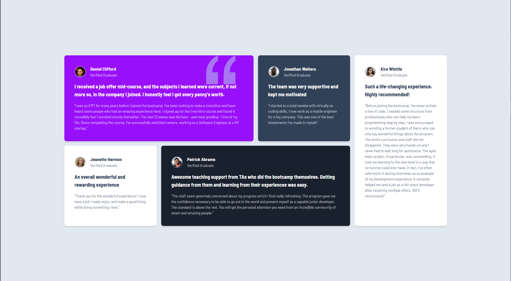

# Frontend Mentor - Testimonials Grid Section Solution

This is a solution to the [Testimonials Grid Section challenge on Frontend Mentor](https://www.frontendmentor.io/challenges/testimonials-grid-section-Nnw6J7Un7). Frontend Mentor challenges help you improve your coding skills by building realistic projects.

## Table of Contents

- [Overview](#overview)
  - [The Challenge](#the-challenge)
  - [Screenshot](#screenshot)
  - [Links](#links)
- [My Process](#my-process)
  - [Built With](#built-with)
  - [What I Learned](#what-i-learned)
  - [Continued Development](#continued-development)
  - [Useful Resources](#useful-resources)
- [Author](#author)
- [Acknowledgments](#acknowledgments)

## Overview

### The Challenge

Users should be able to:

- View the optimal layout for the site depending on their device's screen size.
- See hover states for interactive elements.

### Screenshot


**Desktop view showcasing the responsive testimonials grid layout.**


**Mobile view showcasing the responsive testimonials grid layout.**

### Links

- Solution URL: [Add solution URL here](https://your-solution-url.com)
- Live Site URL: [Add live site URL here](https://your-live-site-url.com)

## My Process

### Built With

- Semantic HTML5 markup
- CSS custom properties
- Flexbox
- **CSS Grid**
- Mobile-first workflow
- [React](https://reactjs.org/) - JS library
- [Vite](https://vitejs.dev/) - Build tool
- [Tailwind CSS](https://tailwindcss.com/) - Utility-first CSS framework
- TypeScript

### What I Learned

This project helped me improve my understanding of **CSS Grid** and how to create responsive layouts. I learned how to use `grid-template-columns`, `grid-template-rows`, and utility classes in Tailwind CSS to build a dynamic grid system.

Here’s an example of how I used CSS Grid in this project:

```html
<section class="grid gap-4 grid-cols-1 md:grid-cols-2 lg:grid-cols-4">
  <div class="bg-white p-4 rounded-lg shadow">Item 1</div>
  <div class="bg-white p-4 rounded-lg shadow">Item 2</div>
  <div class="bg-white p-4 rounded-lg shadow">Item 3</div>
  <div class="bg-white p-4 rounded-lg shadow">Item 4</div>
</section>
```

Additionally, I created custom utility classes in Tailwind CSS to enhance the design:

```css
@layer utilities {
  .bg-custom-pattern {
    background: repeating-linear-gradient(
        90deg,
        #575757 0,
        #575757 5%,
        transparent 0,
        transparent 50%
      ), repeating-linear-gradient(180deg, #575757 0, #575757 5%, transparent 0, transparent
          50%);
    background-size: 3em 3em;
    background-color: #fafafa;
    opacity: 0.85;
  }
}
```

### Continued Development

In future projects, I want to focus on:

- Further mastering **CSS Grid** for complex layouts.
- Improving accessibility (WCAG compliance).
- Exploring more Tailwind CSS plugins for animations and typography.

### Useful Resources

- [Tailwind CSS Documentation](https://tailwindcss.com/docs) - Helped me understand how to use utility classes effectively.
- [CSS Tricks - A Complete Guide to Grid](https://css-tricks.com/snippets/css/complete-guide-grid/) - A great resource for learning CSS Grid.

## Author

- Frontend Mentor - [@yourusername](https://www.frontendmentor.io/profile/yourusername)
- Twitter - [@yourusername](https://twitter.com/yourusername)

## Acknowledgments

Thanks to the Frontend Mentor community for providing feedback and inspiration for this project.
